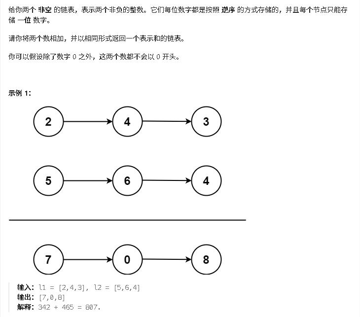

# 两数之和

[代码传送门](../../code/1-100/2addTwoNumbers.py)

# 题目

## 题解思路
这题主要就是熟悉一下链表的使用，链表已经是逆序排好的，就是和我们正常写加法的时候竖式一样已经低位对齐了，
我们只需判断相加后的值有没有大于10，并且需要进位，
如果两个数字长度不一样，剩下的数字继续进行加法和进位就可以了

## 可能遇到的问题
1. 没有考虑进位，或者进位有问题
2. 两个数字长度不一样的时候如何进位
3. 特殊条件判断

## 优化空间
笔者这里是在相加的时候直接考虑进位的情况？
或许可以先把每一位都算出来，然后大于等于10的数再进行拆开，感觉时间复杂度会更高，（提供另外的一种思路）
