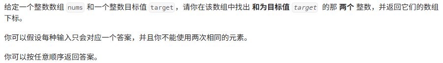

# 两数之和

[代码传送门](../../code/python/1-100/1_SumOfTwoNumbers.py)

## 目录

<!-- TOC -->

* [两数之和](#两数之和)
    * [题目](#题目)
    * [题解思路](#题解思路)
    * [可能遇到的问题：](#可能遇到的问题)
    * [改进的空间：](#改进的空间)

<!-- TOC -->

## 题目



## 题解思路

题目已经传入一个整形列表，整形数，我们只要从这个输入“List”里面一个个去试着匹配就行了

```python
class Solution:
    def twoSum(self, nums: List[int], target: int) -> List[int]:
        Lst = []
        for i in range(len(nums)):
            for y in range(i + 1, len(nums)):
                if nums[i] + nums[y] == target:
                    Lst.append(i)
                    Lst.append(y)
                    return Lst
```

## 可能遇到的问题：

1. 返回值是列表元素的**下标**，不是元素的值。

2. 循环遍历列表的时候最好是用下标（用**range（）**生成下标）去遍历，而不是直接用列表元素（形如：for i in nums这种），否则会造成许多意外问题。

## 改进的空间：

1. 第二层遍历可以为了减小时间开销，可以从i+1个元素开始遍历，而不是第二层又重新从列表第一个元素开始（因为我们从最开始以及把前面的情况考虑进去了，这里不需要重复去找前面的值）。（节省时间）
2. 可以不用列表来存储我们最后的答案，我们最后可以直接自己输出“【a,b】”的格式，不用为列表去声明额外的空间。（节省空间）


