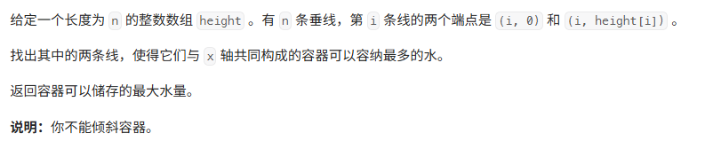
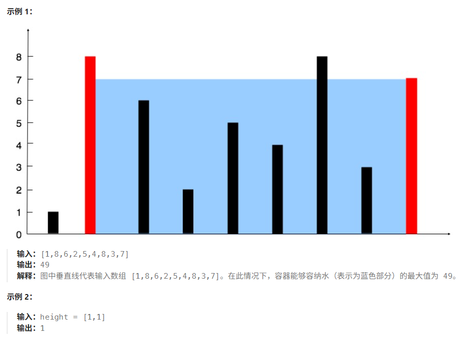
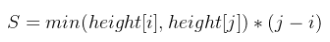
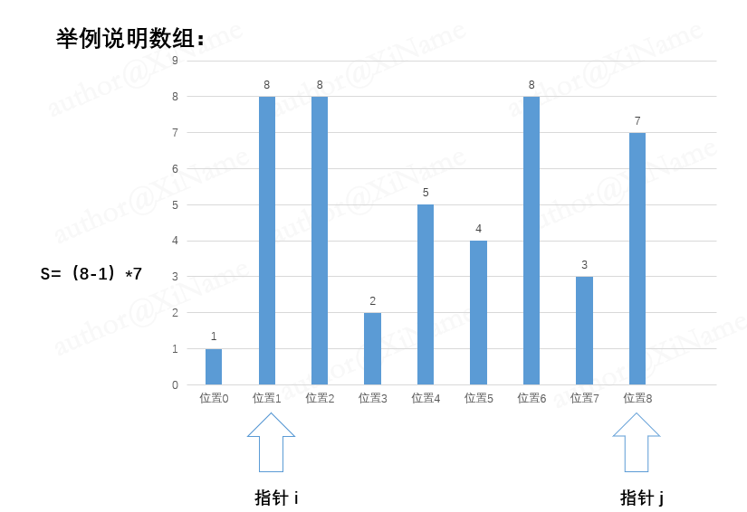
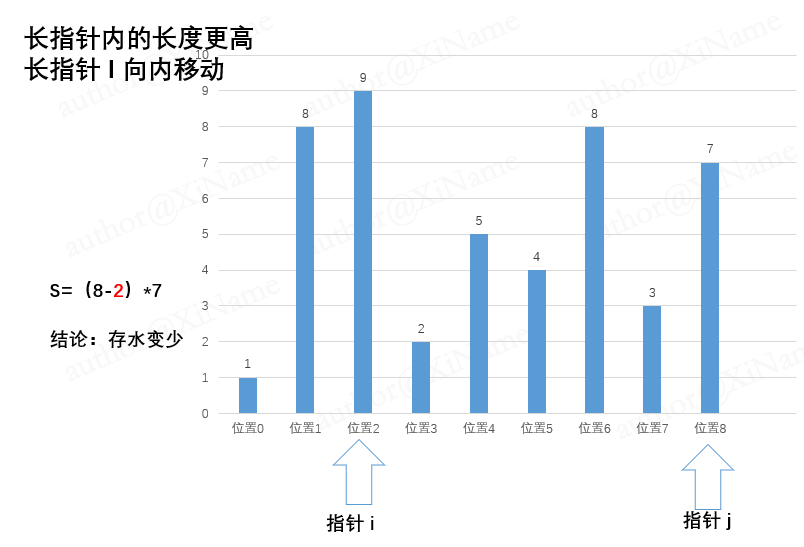
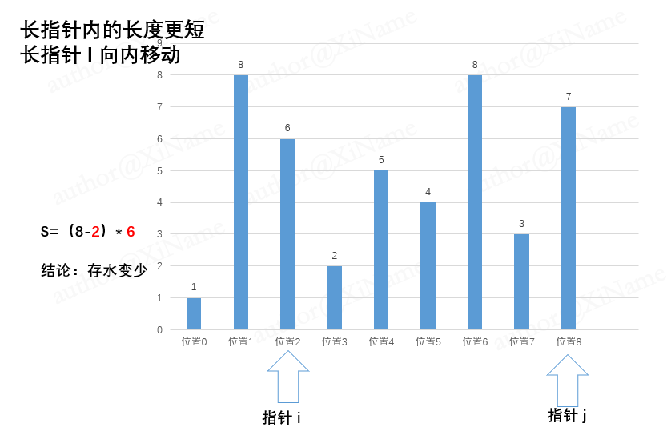
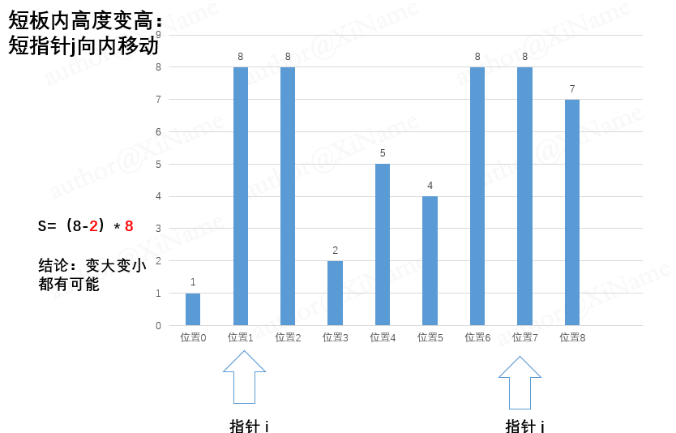
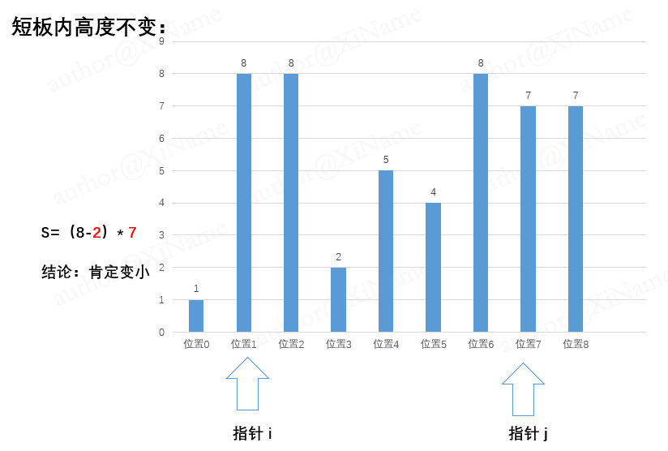
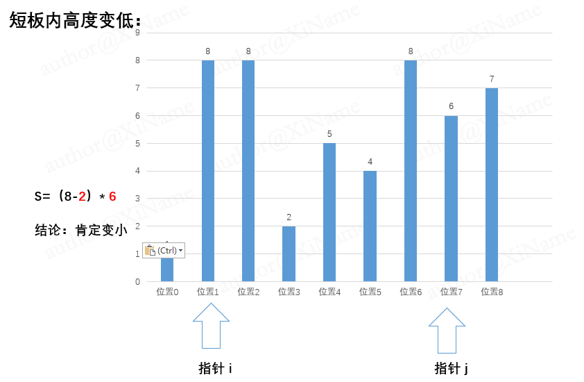

# 盛最多水的容器

[代码传送门](../../code/python/1-100/11_maxArea.py)

## 目录
<!-- TOC -->
* [盛最多水的容器](#盛最多水的容器)
  * [目录](#目录)
  * [题目](#题目)
  * [题解思路](#题解思路)
    * [详细分析](#详细分析)
      * [详细分析一（移动高木板）](#详细分析一移动高木板)
      * [详细分析二（移动短木板）](#详细分析二移动短木板)
  * [本题完整代码](#本题完整代码)
  * [可能遇到的问题：](#可能遇到的问题)
  * [改进的空间：](#改进的空间)
<!-- TOC -->

## 题目





## 题解思路

先根据题目进行分析，就是一个求体积最大的问题，抽象成二维平面实际上就是一个求最大面积的问题：

首先假设有两个指针 i，j 从数组的两端开始，他们所指向的长条高度分别为：

height[i] ,height[j]

根据木板效应，题中能装多少水是取决于我们最短的木板，所以我们要求的面积为：



上述式子为什么是`min（height[i]，height[j]）`呢？详细看下述分析

### 详细分析

我们本来是想去求最大值，让 i ，j 把每一个位置试遍显然会超时，我们要采取其他办法：

#### 详细分析一（移动高木板）
我们如果只挪动高的木板，由于木板效应，存放的水只有变少有可能不变，绝不可能变多！下面展开论证：

分三种情况讨论：

- 第一种，高的木板里面的木板高度一样，由于长度（横坐标变化）显然水变少；如图所示：




- 第二种，高的木板里面的木板高度变得更高，我们能装多少水是由短板决定，存放水变少；



- 第三种高木板里面是短木板（比他自己短），这种情况变少：



**综上所述，我们移动长木板的时候，无论如何都无法使木桶盛的水变多**

#### 详细分析二（移动短木板）

如果我们选择短板移动，那么效果就完全不一样了，下面展开论述：

- 第一种情况短板内高度变高，这时候存水可能变少也有可能变多：



- 第二种情况短板高度不变，这种情况肯定变少！



- 第三种情况短板内高度更低：这种情况也是变少：



**综上所述：要是存水面积变大我们只能采取移动短板的方法，换言之我们要找到存水最大的方法，
就是把 i，j 两个指针从头开始向内移动，每次移动较短的那一个，直到 i，j 相遇，期间肯定能找对最大值。**

## 本题完整代码
```python
class Solution:
    def maxArea(self, height: List[int]) -> int:
        # 初始化两个指针 i=0, j=len(height)-1
        i, j = 0, len(height) - 1
        maxArea = 0
        while i != j:
 
            if height[i] < height[j]:
                min_height = height[i]
                # print('i = {}, j = {}'.format(i, j))
                i += 1
            else:
                min_height = height[j]
                # print('i = {}, j = {}'.format(i, j))
                j -= 1
            # 这里长度变成 j - i + 1 是因为前面会多减一个1，造成结果有问题！！！
            maxArea = max(maxArea, (j - i + 1) * min_height)
            # print('maxArea = {},min_height = {}'.format(maxArea, min_height), )
        return maxArea
```


## 可能遇到的问题：
1. 无脑暴力循环，中等组一般会超时
2. 移动了高指针，找错了最大值
3. 最后计算 maxArea 没注意前面指针减 1 了，可能会有问题
4. 数学抽象能力较弱

## 改进的空间：
中间的 min_height 可以尝试不用变量存起来，可以节省一定空间（留给读者）