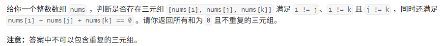
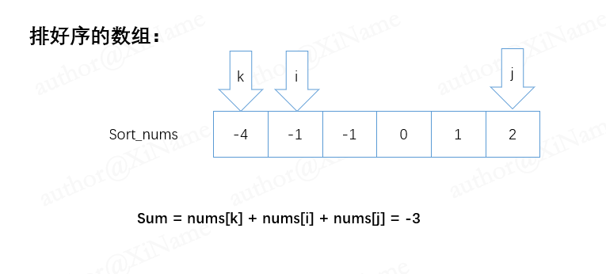
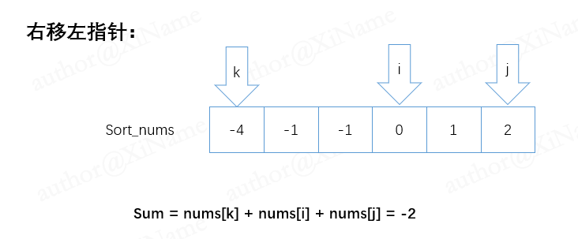
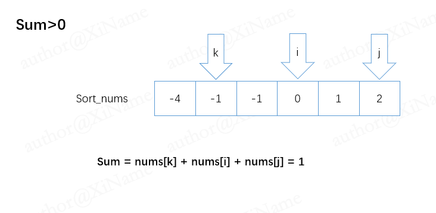
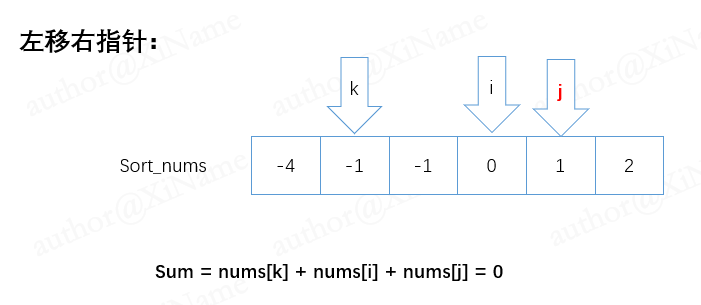
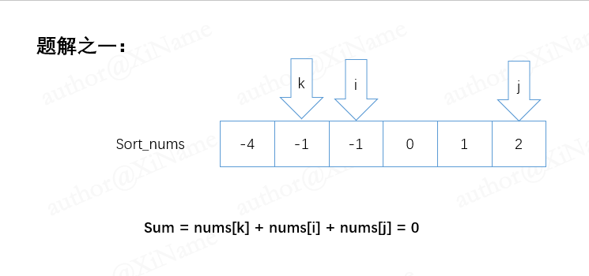

# 三数之和

[代码传送门](../../code/1-100/15_threeSum.py)

<!-- TOC -->
* [三数之和](#三数之和)
  * [题目](#题目)
  * [题解思路](#题解思路)
    * [分类讨论一](#分类讨论一)
    * [分类讨论二](#分类讨论二)
    * [分类讨论三](#分类讨论三)
  * [本题完整代码](#本题完整代码)
  * [可能遇到的问题：](#可能遇到的问题)
  * [改进的空间：](#改进的空间)
<!-- TOC -->

## 题目



## 题解思路
```
首先暴力解法，三个for循环肯定能解，不过肯定会超时，排除。

想要排除重复的情况，可以利用多指针来剔除重复的解。（这在降低时间复杂度中很常用）

然后就是对数组进行排序（直接库函数就行），一个无序的数组，我们很难有什么好的办法，这一步也称为数据的预处理，数据在一开头进行预处理，一般能为我们节省大量的时间。

现在我们得到一个排好序的数组了， 然后仿照三层 for 的暴力解法，设三个指针 k ,i , j ，k指针用 for 循环来移动， i，j指针在while循环中移动。

k指针从头开始，i从k+1开始，j从数组末尾开始，其中，k成为固定指针，在一个for循环中位置不变，i，j在一个for循环中可变：
```



### 分类讨论一
我们在一个for循环中，如果nums[k]+nums[i]+nums[j]的值小于0如上图，那么移动左指针i，在nums[i]与nums[i+1]值不同的情况下，可以使得我们的三数之和可以变大：



### 分类讨论二
如果  nums[k]+nums[i]+nums[j]  的值大于0 ，在nums[j]与nums[j-1] 的值不同的情况下，可以使我们的sum三数之和值变小：





### 分类讨论三

如果  nums[k]+nums[i]+nums[j] 的值加起来正好使0 ，那就是我们的答案：


```
对于题解我们还不能直接存入到结果数组，在存入到我们的结果数组之前，还需要检查是否重复！ （这里体现了我们对数组预排序的好处。）

当我们的i、j相遇的时候，这个for循环就能结束了。

然后对k用一个for循环使他能走便每一个位置，这样不会漏解。

还有一个减少时间消耗的办法：

当我们nums[k]的值大于0时可以直接退出，后面的三者之和一定大于0，没有题解。

这样一来有暴力解法的时间复杂度O(N^3)变成了O(N^2）降低了复杂度
```

## 本题完整代码
```python
class Solution:
    def threeSum(self, nums: List[int]) -> List[List[int]]:
        # 对数组排序
        nums.sort()
        new_nums = []
        # 特例
        if len(nums) < 3 or nums is None:
            return []
        for k in range(len(nums) - 1):
            # 结束条件
            if nums[k] > 0:
                break
            i, j = k + 1, len(nums) - 1
            while True:
                if i == j:
                    break
                sum_nums = nums[k] + nums[i] + nums[j]
                if sum_nums == 0:
                    temp_nums = [nums[k], nums[i], nums[j]]  # 注意顺序，用来判断是否重复的解
                    # print("k,i,j,temp_nums:",k,i,j,temp_nums)
                    if temp_nums not in new_nums:
                        new_nums.append(temp_nums)
                    i += 1
                # 移动指针
                elif sum_nums > 0:
                    j -= 1
                elif sum_nums < 0:
                    i += 1
        return list(new_nums)
```

## 可能遇到的问题：

1. 我们有三个指针，但题目给的数组元素小于三或者是一个空数组要特判！
2. for循环里面有一个while循环，while一定要注意有退出条件！
3. 重复的解要剔除！

## 改进的空间：

我们这里剔除重复元素的办法是用库函数（in）来检测，我们可以自己在函数中设计指针移动，使其解肯定不重复，这样可以再进一步减少时间复杂度。（留给读者）
