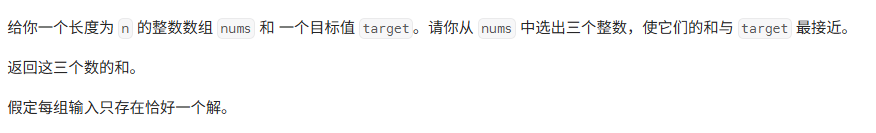
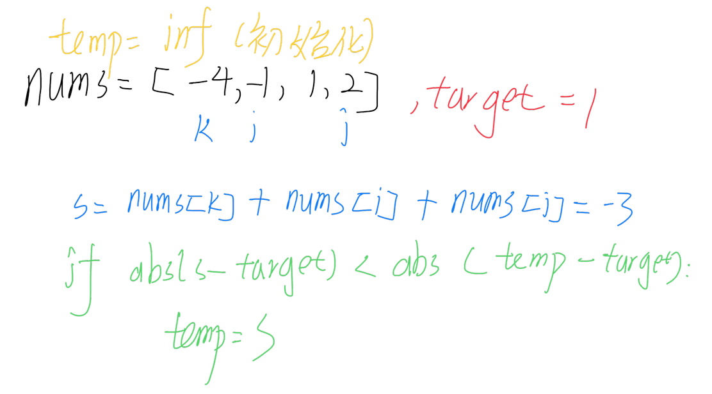

# 最接近的三数之和

[代码传送门](../../code/1-100/16_threeSumClosest.py)

<!-- TOC -->
* [最接近的三数之和](#最接近的三数之和)
  * [题目](#题目)
  * [题解思路](#题解思路)
  * [本题完整代码](#本题完整代码)
  * [可能遇到的问题：](#可能遇到的问题)
  * [改进的空间：](#改进的空间)
<!-- TOC -->

## 题目



## 题解思路
```
这题看上去就和15题差不多，无非就是一个是能等于target，一个可能等于target可能不等于，要找一个最接近的值，我们在上题的基础上，只要增加一个临时变量temp来记录目前最接近的值，每次比较都要进行更新值的操作即可。三指针按照上题所述，正常进行移位即可。

我们这里还能略微优化一下，如果temp为0说明题目给的数组正好有三个数之和等于target，这时候直接返回答案即可。
```



## 本题完整代码

```python
class Solution:
    def threeSumClosest(self, nums: List[int], target: int) -> int:
        nums.sort()
        temp = inf
        for k in range(len(nums)):
            i, j = k + 1, len(nums) - 1
            while i < j:
                s = nums[k] + nums[i] + nums[j]
                if s == target:
                    return s
                # 更新值
                if abs(s - target) <= abs(temp - target):
                    # print('s,k,i,j', s, nums[k], nums[i], nums[j])
                    temp = s
                # 移动指针
                if s <= target:
                    i += 1
                elif s > target:
                    j -= 1
 
        return temp
```

## 可能遇到的问题：
1. 更新值的时候要明确知道比较的是谁离 target 比较近，要带绝对值
2. 移动指针的时候要注意，我们是根据我们的三数之和与 target 大小比较来进行移动指针
3. 移动指针的时候要考虑 = 的条件，不然会有死循环
4. temp初始化要为最大值，不然后面比较会出问题

## 改进的空间：
中途还有部分小细节可以减少一点重复计算的步骤

例如和15题一样，如果nums[k]的值都比target大，那么直接退出循环，因为后面的结果会渐行渐远（留给读者）


