# 移除元素（双指针法)

[代码传送门](../../code/python/1-100/27_Remove_elements.py)

## 目录
<!-- TOC -->
* [移除元素（双指针法)](#移除元素双指针法)
  * [题目](#题目)
  * [题目释义：](#题目释义)
  * [题解思路：](#题解思路)
  * [本题完整代码](#本题完整代码)
  * [可能遇到的问题：](#可能遇到的问题)
  * [改进的空间：](#改进的空间)
<!-- TOC -->

## 题目

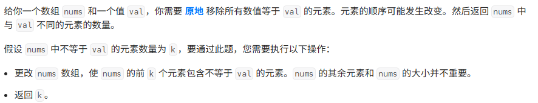

##  题目释义：

这个题目和上面的第 26 题有一点相似，但是又不完全一样：

这里的数组不再是一个排好序的数组的，操作难度更大，而且只能使用O（1）的额外空间，O（1）的意思是我们所使用的空间必须与传入的数组无关。换言之，我们所使用的空间不随nums的长度变长而变成，是一个常量1。

最重要的一点，对nums进行原地修改，可以改变nums的值，但是**不能改变它的长度！**

我们可以用类似与26题的方法进行操作，把 val 值的数字**丢到后面！（记住这里）**

## 题解思路：

上面一题我们已经有思路如何处理了，但是第 26 题是一个排好序的数组，所以这里先对数组排序并且要要保留排好序的值，直接用sort（）方法就可以了

注意 sort（）会保留排好序的值，而sorted（）不会！注意两者区别！

接下来我们应该如何去做呢？这里采用上面提到的双指针的办法来处理！

首先我们假设有一个这样的数组nums=[1,2,3,3,4,4,5,6,7]

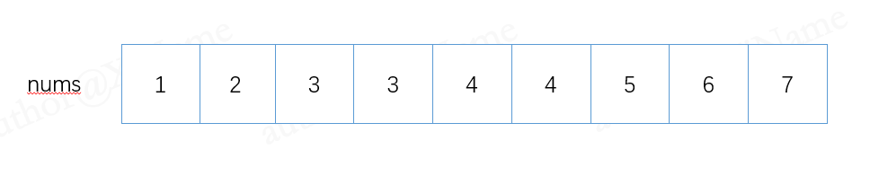

再假设有上下两个指针，high_point 和 low_point ，从数组的第一个位置开始，如下：

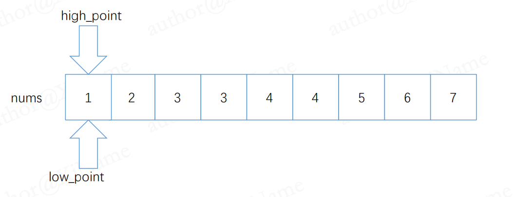

因为我们只需要把 val 指定的值剔除就可以了，不等于 val 的值无需理会，所以接下来的操作就是移动上、下指针 high_point ，low_point去找到我们 val 指定的值 ，这里假设 val = 3 ，此时，我们的下指针移动到第一个数字3，如图：

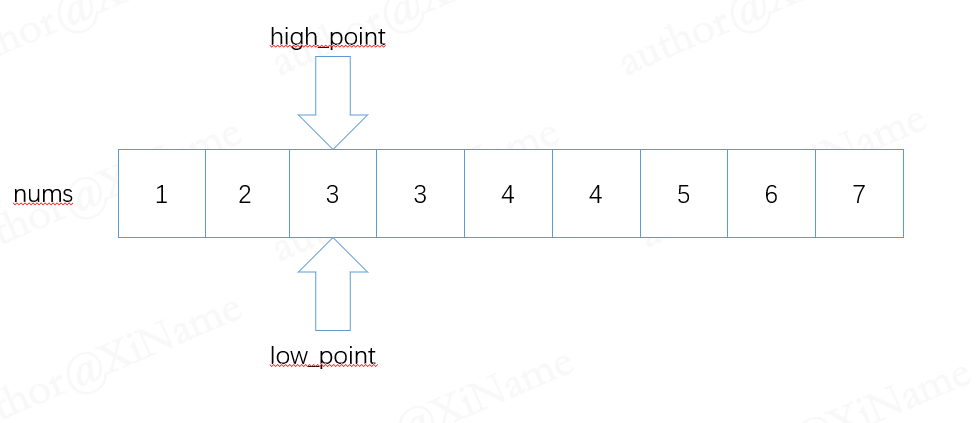

接下来就是把 3 剔除就行了，问题就在于我们如何剔除。

如果直接把3丢在最后一位，把 7 放到现在 3 的位置，如下：

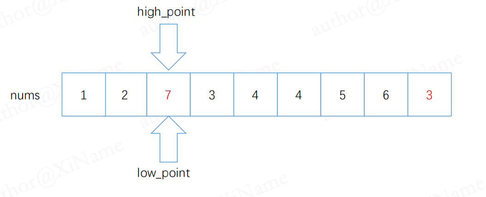

那么下一个3就要丢在倒数第二个位置，因为倒数第一个位置已经变成 3 ，而 3 是我们希望能放在最后面的这样一来，如果这里连续的要剔除的数字很多的话，我们还要额外去用一个临时变量去记录我们目前数组后面 3 的数量，造成额外的空间开销，并且这个额外空间开销很可能因为我们的nums变长而变长，**不符合**题意！！！（我们上面要求额外的空间开销不随 nums 变长而变长。

我们的目的是找到与 3 不一样的数字来替换它，所以我们这里让下指针继续向后面移动（在数组的范围内），直到我们找到后面第一个不是 val 的数字，如图：

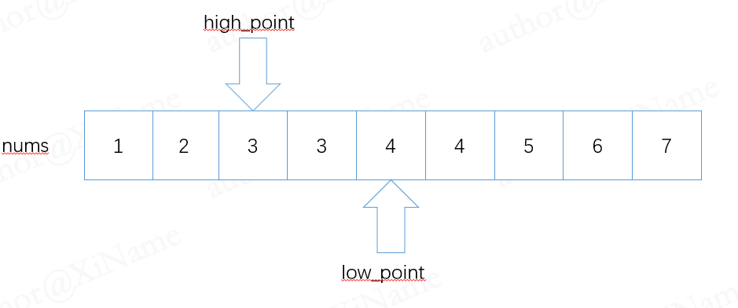

现在我们只需要把 3 和 4 的位置互换，就可以把 3 丢到后面去了，如图：

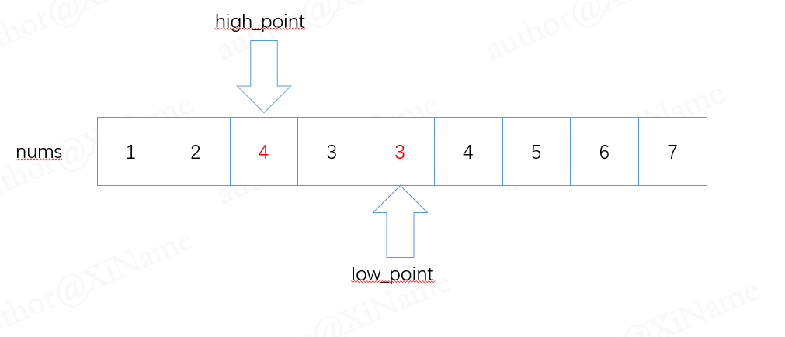

然后上下指针**同时**移动，再把黑色的 3 和 黑色 的 4 进行位置互换，因为要把3，3放到最后面，所以一直这样操作下去：

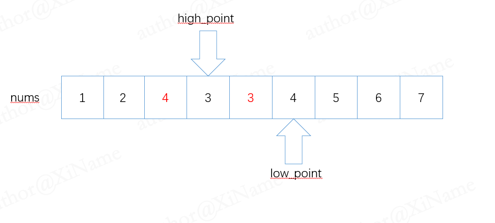

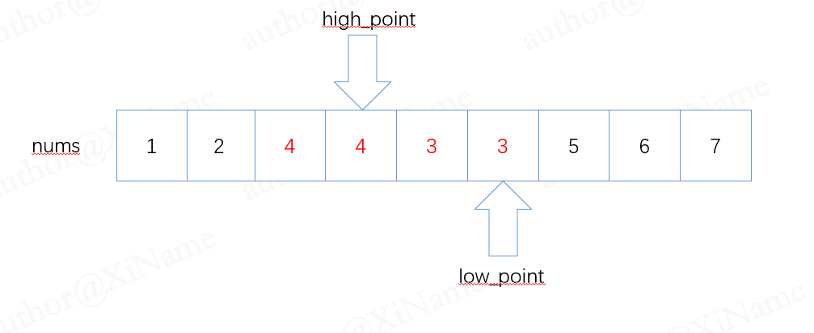

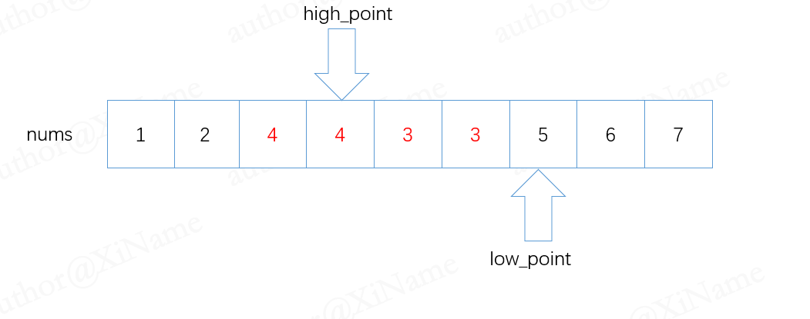

直到我们下指针知道数组的最后一个位置的时候，就可以把上指针的位置返回，注意这里的的两个3在每一步中都被换过位置，此时上指针的位置就是答案了：

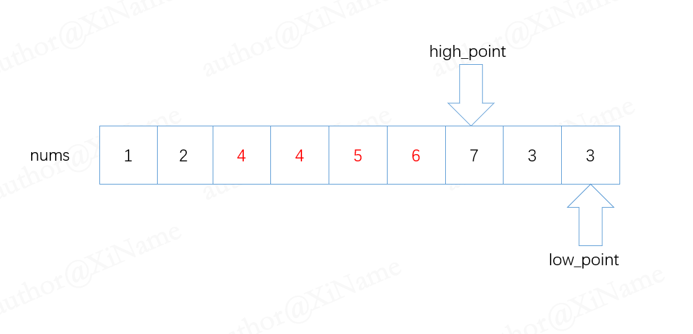

这个数组的长度就是***7*** **（是第7个位置）**

我们再对空数组进行额外的处理，空数组直接返回0就行

还有考虑数组中找不到 val 的情况，这时候把整个数组的长度返回就是正确答案

## 本题完整代码

```python
class Solution:
    def removeElement(self, nums: List[int], val: int) -> int:
        if len(nums) == 0:
            return 0
        nums.sort()
        # 传入数组空的时候，直接返回0
        high_point = 0
        low_point = 0
        for i in range(len(nums)):
            if nums[i] == val:
                # 先找到第一个不一样的值
                high_point = i
                low_point = i
                while i < len(nums) and nums[i] == val:
                    i += 1
                print('1:',high_point, low_point)
                # 两个指针的值不一样！
                low_point = i
                while low_point < len(nums):
                    temp = nums[low_point]
                    nums[low_point] = nums[high_point]
                    nums[high_point] = temp
                    high_point += 1
                    low_point += 1
                    print('2:',high_point, low_point)
                break
            else:
                high_point = len(nums)
        return high_point
```

## 可能遇到的问题：
1. 上下指针一直在增加，注意他们的值不要超过数组的长度

2. 要对特殊情况进行处理，如：空数组，或者数组中没有 val 的值，即无需剔除的情况

## 改进的空间：
 
提交答案后发现运行时间比较短，运行占用的空间比较大

这里的空间主要是sort（）函数排序时占用的空间，读者可以思考如果不进行事先排序如何处理。