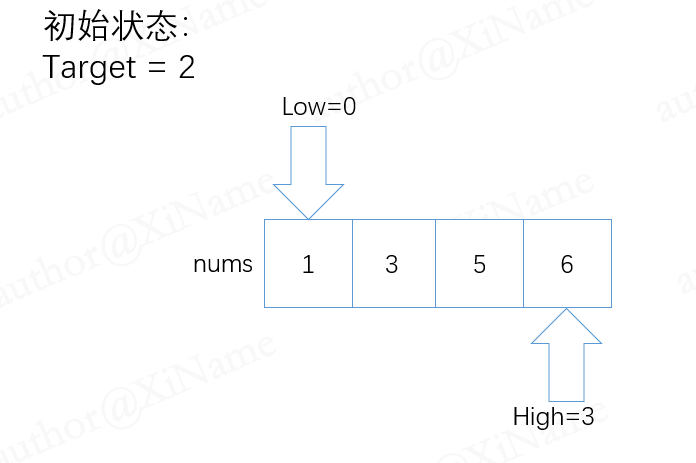
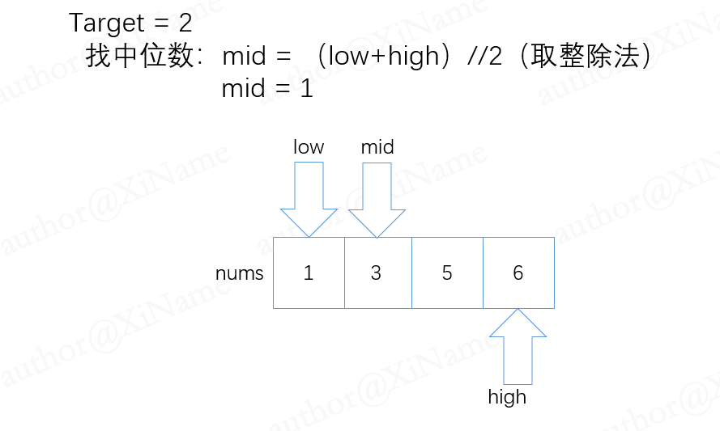
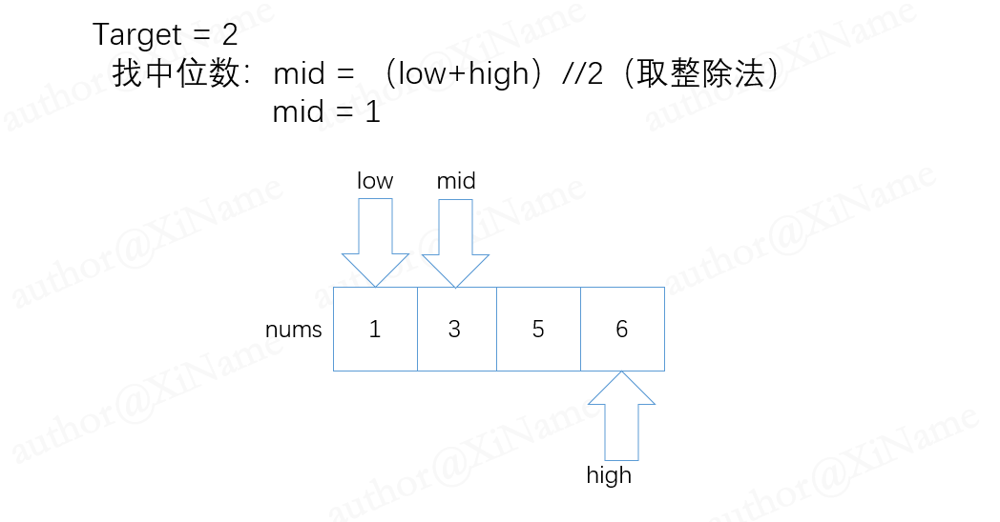
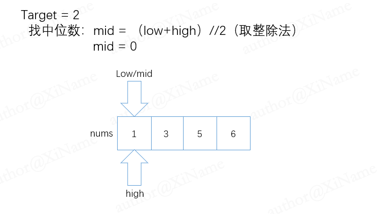

# 搜索插入位置

[代码传送门](../../code/1-100/35_Search_insertion_location.py)

## 目录

<!-- TOC -->
* [搜索插入位置](#搜索插入位置)
  * [目录](#目录)
  * [题目](#题目)
  * [题解思路：](#题解思路)
  * [本题完整代码:](#本题完整代码)
  * [可能遇到的问题：](#可能遇到的问题)
  * [改进的空间：](#改进的空间)
<!-- TOC -->

## 题目

[img_5.png](../../pic/1-100/35/img_5.png)

## 题解思路：

首先可以先直接用库方法，如果 target in nums 那就好办了，直接返回target 的索引即可

```python
        if target in nums:
            return nums.index(target)
```

如果不在的话我们需要去寻找合适的位置进行插入，首先排除一个个插入的方法，因为太低效了，而且时间复杂度是O（n）与题目要求不符，题目要求的是O（log n）的复杂度直白的说就是我们的`def searchInsert(self, nums: List[int], target: int) -> int:`这个函数里面执行次数最多的一条代码的次数不超过 log n （n是nums数组的长度），这里采用更低复杂度二分查找的思路才能更好的满足要求。

二分查找思路很简单：就是有两个指针一个 low 一个 high ，初始 low = 0，high = len（nums）- 1 ，然后找中间值 mid 与low和high比较，low 比 mid 就把low重新赋值为 low = mid +1

high同理即可，否则一直只需循环操作，直到 low > high 时跳出才循环！（看下图用题目例子来说明表示：）



先找mid的位置：



再让 mid 和 target 比较大小，这里 mid 比 target 大，所以我们把 high 赋值为 mid - 1

此时在比较一轮，low ，mid ，high三者位置重叠



此时按照我们的思路， mid 比 target 小，所以我们让 low = mid + 1，此时各指针情况如下：



已经不满足我们循环的条件了，跳出循环，此时 low 指针的值就是我们要插入的位置，返回它的值即可。 

## 本题完整代码:

```python
    def searchInsert(self, nums: List[int], target: int) -> int:
        # 二分查找
        if target in nums:
            return nums.index(target)
        low, high = 0, len(nums) - 1
        while low <= high:
            mid = low + (high - low) // 2
            if nums[mid] <= target:
                low = mid + 1
            elif nums[mid] > target:
                high = mid - 1
        return low
```

##  可能遇到的问题：

1. 二分查找的边界没确定好
2. 返回值不明确，不知道是返回什么
3. mid要做取整操作，不然数组无法访问下标

## 改进的空间：

把一开始用库方法的部分也加入到二分查找的代码里面（留给读者）
