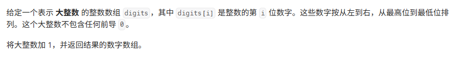
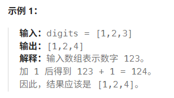
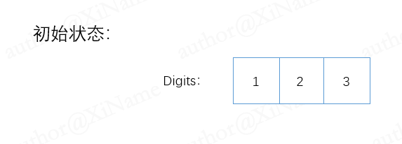
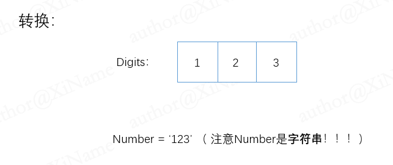
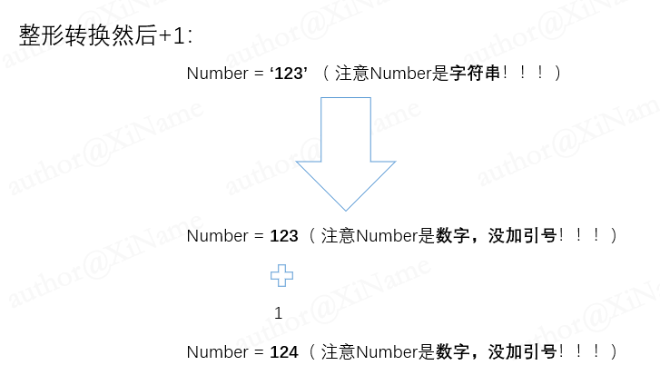
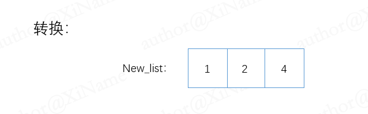

## 加一

[代码传送门](../../code/1-100/66_Sum_one.py)

## 目录

<!-- TOC -->
  * [加一](#加一)
  * [目录](#目录)
  * [题目](#题目)
  * [题解思路：](#题解思路)
  * [本题完整代码:](#本题完整代码)
  * [可能遇到的问题:](#可能遇到的问题)
  * [改进的空间：](#改进的空间)
<!-- TOC -->

## 题目



## 题解思路：

第一看看上去是不是很简单？不就是小学的加法吗？直接对数组的最后一位进行加法不就好了吗？

但是数组的最后一位如果是9，再加一就是 10 不符合题目的每个元素存储单个数字的要求！

如果我们想要继续直接对数组进行运算，那就需要判断每一位是否以及超过 10 ，超过 10 要往前面进一位，数组的每一位都要这样判断很麻烦，数字大的时候消耗很多时间！！！

这里采用简洁的方法：（类型转换）

首先我们把数组的每一位取出来变成一个新字符串（还是用题目的示例一举例：）





先转成整形数，把 digits 的数一个个拿出来再用 + 直接把他们拼起来



把Number转成整形数变成 123 ，整型数的加 1 才是数值加 1 ，而不是字符串的拼接 



再把Number按照我们的要求转成新列表，就是题目要求的结果！！



## 本题完整代码:

```python
class Solution:
    def plusOne(self, digits: List[int]) -> List[int]:
        # 定义一个字符空串
        number = ''
        # range（x）产生列表的范围是【0，x)，包括0不包括x
        for i in range(len(digits)):
            number += str(digits[i])
        # 把 number 转成整形然后再加一
        number = int(number) + 1
        # 把整形数按位先倒叙存入新列表
        str_number = str(number)
        new_list = [int(i) for i in str_number]
        # 上面是简写形式，与下面注释等价：
        # new_list = []
        # for i in str_number:
        #     new_list.append(int(i))
        return new_list
```

## 可能遇到的问题:

1. 结果数组里面只能是单个数字不能存放一个位置存放一个两位数！
2. 最后返回的列表里面要求是 整形 （int） 类型，最后存数据到new_list的时候要注意类型转换！

## 改进的空间：

1. 消耗内存空间很多， str 和 list 都是不定长的数据类型，耗费空间大
2. 可以用上文所述，直接对原数组进行操作，逢十进一（留给读者）