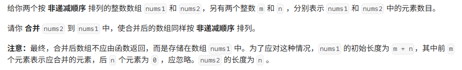

# 合并两个有序数组

[代码传送门](../../code/1-100/88_Merge_two_sorted_array.py)

## 目录

<!-- TOC -->
* [合并两个有序数组](#合并两个有序数组)
  * [目录](#目录)
  * [题目](#题目)
  * [题解思路：](#题解思路)
  * [本题完整代码：](#本题完整代码)
  * [可能遇到的问题：](#可能遇到的问题)
  * [改进的空间：](#改进的空间)
<!-- TOC -->

## 题目



## 题解思路：

这题本身不难，你不要想着在直接在 nums1 上进行修改，你这样要对每一个插入一次，就要对后面很多的数据进行移动费时而且麻烦！直接生成一个临时数组存放，最后再把临时数组复制到原来的 nums1 里面，省时间！

临时数组的很好创建，先设两个指针指向两个数组的首位置，然后把 nums1 和 nums2 目前指针比较一下大小，较小这放入临时数组里面存着，一直下去就能把数组排完。

## 本题完整代码：

```python
class Solution:
    def merge(self, nums1: List[int], m: int, nums2: List[int], n: int) -> None:
        i, j = 0, 0
        num_temp = []
        while i < m and j < n:
            if nums1[i] < nums2[j]:
                # num1不变，只需移动指针 i 即可
                num_temp.append(nums1[i])
                i += 1
            else:
                num_temp.append(nums2[j])
                j += 1
        # 把剩下的合并到num_temp里面
        while i < m:
            num_temp.append(nums1[i])
            i += 1
        while j < n:
            num_temp.append(nums2[j])
            j += 1
        # 保证nums1【：】还是原来的那个序列，进行序列的复制操作
        nums1[:] = num_temp
```

## 可能遇到的问题：

1. 最后忘记把临时数组复制到原来的 nums1 里面

2. nums1 是一个数组，不能当作一个变量来进行传值（这里最容易出错！）

## 改进的空间：

笔者为了让大家更好理解把while拆开了，大家可以把while的内容结合一下（留给读者）

