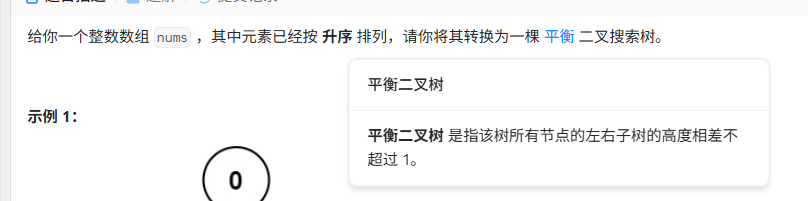
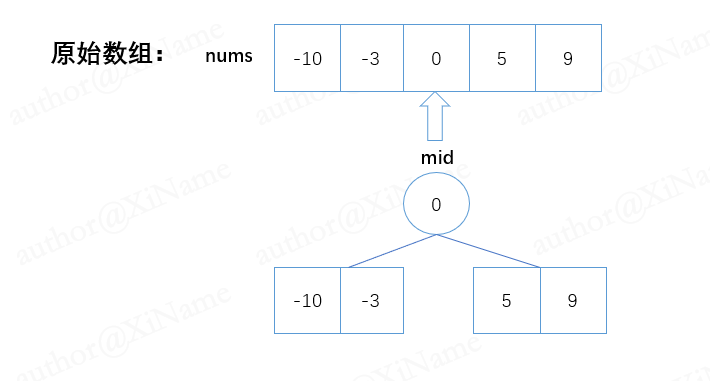
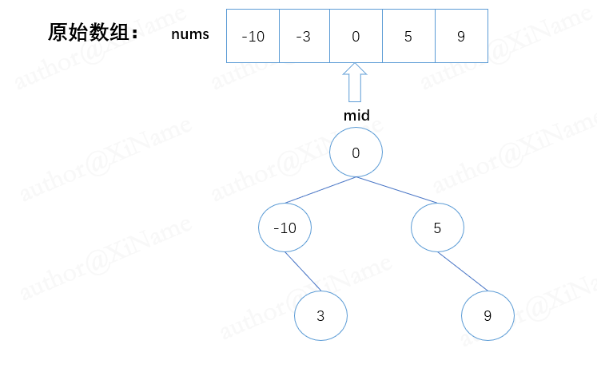

# 将有序数组转换为二叉搜索树

[代码传送门](../../code/101-200/108_sortedArrayToBST.py)

<!-- TOC -->
* [将有序数组转换为二叉搜索树](#将有序数组转换为二叉搜索树)
  * [题目](#题目)
  * [题解思路](#题解思路)
  * [本题完整代码](#本题完整代码)
  * [可能遇到的问题：](#可能遇到的问题)
  * [改进的空间：](#改进的空间)
<!-- TOC -->

## 题目



## 题解思路
```
本题的二叉搜索树简单来说，就是有一颗树，它的左结点一定比中间结点小，中间结点一定比右边结点小的二叉树，成为二叉搜索树。

由于数组已经是按升序排序的，我们可以采用递归的思想，把数组中间的值作为根结点，然后把中间值左边部分数组递归调用函数，中间的值右边部分也是额外的递归调用。（注意递归出口）看图：
```


然后递归的把 左边的数组【-10，-3】和 右边的数组【5，9】按照上面的步骤继续构成一颗树：



## 本题完整代码

```python
class Solution:
    def sortedArrayToBST(self, nums: List[int]) -> [TreeNode]:
        # 递归出口，判断nums是否为空,为空返回空结点
        if len(nums) == 0:
            return None
        mid = (len(nums) - 1) // 2
        root = TreeNode(nums[mid])
        # print('now_mid is :', nums[mid])
        root.left = self.sortedArrayToBST(nums[:mid])
        root.right = self.sortedArrayToBST(nums[mid + 1:])
        return root
```

## 可能遇到的问题：
1. 递归办法操作的函数一定要有递归出口！
2. mid取值可以是中间偏左即（mid = len(nums - 1) 和中间偏右即（ mid = len（ nums + 1），但是采用中间偏左可以很大程度上避免一些数组越界的问题。

## 改进的空间：
递归的办法思路简单明了，但是消耗的内存空间很大！不能处理很大的一棵树，即递归深度有限（最大的局限）

这里可以采用不递归的办法来写（任何递归的函数都可以用一种不递归的方式来实现）（留给读者）
