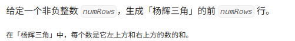
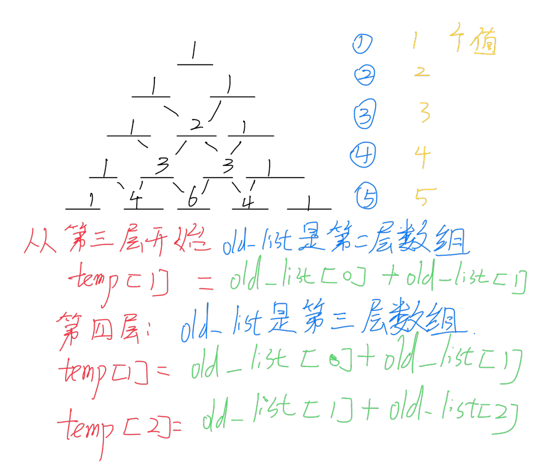

# 杨辉三角

[代码传送门](../../code/python/101-200/118_YangHuiTriangle.py)

<!-- TOC -->
* [杨辉三角](#杨辉三角)
  * [题目](#题目)
  * [题解思路](#题解思路)
  * [本题完整代码](#本题完整代码)
  * [可能遇到的问题：](#可能遇到的问题)
  * [改进的空间：](#改进的空间)
<!-- TOC -->

## 题目



## 题解思路

从题目给的图案能看，很明显每一行的首位数字都是 1 ，然后每一行的第 i 个数字的值都是由上一行的第 i - 1个值加上上一行的第 i 个值，知道这个规律就能写代码了



## 本题完整代码

```python
class Solution:
    def generate(self, numRows: int) -> List[List[int]]:
        new_list = []
        # 其他情况：
        for numrow in range(1, numRows + 1):  # numrow 意思是行数
            # 特例
            if numrow == 1:
                new_list.append([1])
                continue
            if numrow == 2:
                new_list.append([1, 1])
                continue
            # print(f'new_list{new_list}')
            temp_list = [1]  # 每行第一个数都是1
            # 每一行应该有 n=numrow 个数
            for num in range(1, numrow - 1):  # 从1循环到numrow-2
                old_list = new_list[numrow - 2] # 上一层的数组
                temp_list.append(old_list[num - 1] + old_list[num])
 
            temp_list.append(1)  # 添加最后一个元素
            new_list.append(temp_list)
        return new_list
```

## 可能遇到的问题：
1. 第一行和第二行作为特例特殊处理
2. 注意行标和数组下标的范围，不要弄混了
3. 每一行的行首和行尾都是特例 1 特殊处理

## 改进的空间：
这里每一次计算当前层的数值的时候，都用到了上一层的数组，复制数组消耗的空间很大，我们可以多设几个指针指向上一层数组的位置，避免开设temp_list （留给读者）
