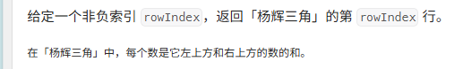

# 杨辉三角 II

[代码传送门](../../code/python/101-200/119_YangHuiTriangleTwo.py)

<!-- TOC -->
* [杨辉三角 II](#杨辉三角-ii)
  * [题目](#题目)
  * [题解思路](#题解思路)
  * [本题完整代码](#本题完整代码)
  * [可能遇到的问题：](#可能遇到的问题)
  * [改进的空间：](#改进的空间)
<!-- TOC -->

## 题目




## 题解思路

本题是**118题**的衍生版本，这里的 rowIndex 要求从0开始，我们在 118 题代码的基础上，把for循环的范围变成从 0 开始，并且最后只输出第 rowIndex 行即可！

## 本题完整代码
```python
class Solution:
    def getRow(self, rowIndex: int) -> List[int]:
        new_list = []
        # 其他情况：
        for numrow in range(0, rowIndex + 1):  # 题目最多是33行
            # 特例
            if numrow == 0:
                new_list.append([1])
                continue
            elif numrow == 1:
                new_list.append([1, 1])
                continue
            else:
                temp_list = [1]  # 每行第一个数都是1
                # 每一行应该有 n=numrow + 1 个数,这里 n 从 0 开始
                for num in range(1, numrow): # 只循环n - 2次，首尾都是1，额外处理
                    old_list = new_list[numrow - 1]  # 上一层的数组
                    temp_list.append(old_list[num - 1] + old_list[num])
 
                temp_list.append(1)  # 添加最后一个元素
                new_list.append(temp_list)
 
        return new_list[rowIndex]
```

## 可能遇到的问题：
1. for 循环的范围不清晰，弄混了，导致数组越界
2. 最后只用输出一行，不是输出整个杨辉三角

## 改进的空间：
本题和上一题一样，每次都要新生成一个 temp_list 来存储上一行的值，其实这一步可以省略，节省一定的时间和空间（留给读者）