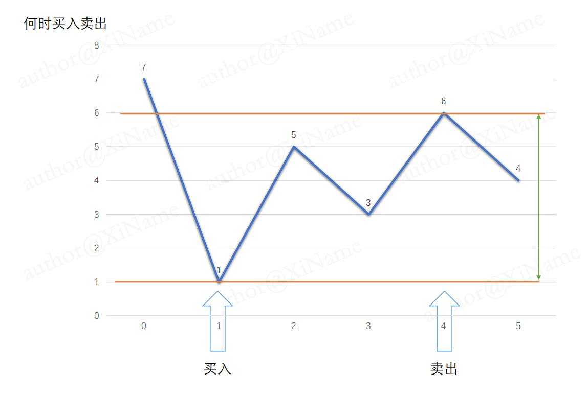

# 买卖股票的最佳时机

[代码传送门](../../code/python/101-200/121_maxProfit.py)

## 题目


## 题解思路

这题是求一个利润最大的问题，profit = prices[ i ] - prices[ j ]，i ，j （ i < j )分别指买入股票的位置和卖出的股票的位置，要使得利润最大，那么买入的时候要尽可能的低价格，卖出的时候要尽可能的高价格。

如下图，我们题目传入一个这样的原始数组：


很直观能看出来我们应该在 1 的位置买入， 在 6 的时候卖出，能得到最大的利润（绿线最长）：



具体到代码实现，我们必须要找一个最小值（即买入值），这个最小值可以在 for 循环的同时去寻找，找到最小值我们要决定什么时候去卖，也就是决定我们的利润要最大。

大家可以这么想，我们现在已经买了股票，那么我们先看一下明天的价格，要是明天的利润比今天高，那么我就把股票拿着，等到下一天去卖，每一天都这样直到我们找到一个利润最大值，并且这个利润最大值是我们遍历完整个 prices 数组之后的结果，那么可以确定这个利润是全局最大利润。

## 本题完整代码

```python
class Solution:
    def maxProfit(self, prices: List[int]) -> int:
        # 初始化利润为 0
        profit, min_price = 0, inf
        for price in prices:
            min_price = min(min_price, price)
            profit = max(profit, price - min_price)
        return profit
```

## 改进的空间
寻找最大最小值的时候可以尝试自己写一下代码，不要老是依赖库函数，用库函数的前提是自己能实现库函数（留给读者）